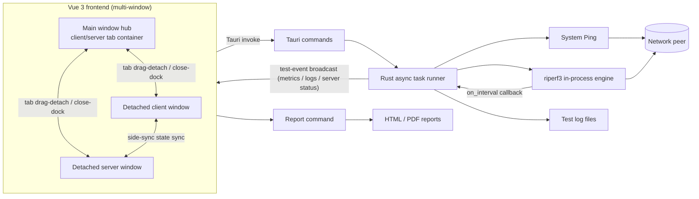

# LinkGauge

[English](README.md) | [中文](README.zh-CN.md)

A desktop network performance testing application built with Rust, Tauri 2, Vue 3, and TypeScript. It provides a structured GUI workflow for Ping, TCP, and UDP testing. TCP/UDP tests run on a pure-Rust, in-process [riperf3](https://github.com/therealevanhenry/riperf3) engine that speaks the iperf3 wire protocol — no iperf3 binary is installed, bundled, or spawned; only Ping uses the system command.

> Current release status: Windows x64 is fully packaged as an NSIS installer. Linux builds are supported from source. The installer contains no third-party network-testing binaries.

## Screenshots

**Client view** — test selection and parameters on the left, live bandwidth chart with local / peer / connection info in the center, task queue and filterable logs on the right, report summary at the bottom.

| English | 简体中文 |
| --- | --- |
|  |  |

**Server view** — listen configuration on the left, server overview (bind address, peer client, uptime, completed tests) with the server-observed bandwidth chart in the center, and server logs on the right.

| English | 简体中文 |
| --- | --- |
|  |  |

## Features

- Client and server operating modes
- English / 中文 UI (English by default), switchable in **Settings**, synced across windows
- Light / dark theme (light by default), switchable in **Settings**, synced across windows
- Server can bind a specific IP and port, with a configurable log/statistics output interval (seconds)
- SSH remote console on the server view: connect to a remote host (password or private key) and drive its iperf3 server from an in-app console with live output — pure-Rust [russh](https://github.com/warp-tech/russh), no system `ssh` client required
- Separate TCP and UDP configuration views
- Ping connectivity checks
- TCP single-direction, bidirectional, parallel-stream, reverse, and stress tests
- UDP bandwidth, jitter, and packet-loss tests
- Sequential test queue with waiting, running, successful, failed, and stopped states
- Live bandwidth chart and aggregate statistics
- Local and peer network information
- Local port of the active connection shown in the client dashboard
- Multi-NIC detection with an interface picker (the first interface is the default) and link-speed reporting
- Bandwidth presets (100 / 1000 Mbps, unlimited) that default to the current NIC link speed
- Packet-length presets (TCP up to 1 MB, UDP up to 64 KB), with a custom length persisted to the config file
- Real-time INFO, WARN, and ERROR logs with filtering
- Engine logs follow the UI language switch at runtime
- Per-test log files with completed/incomplete status in the filename
- Graceful test cancellation (no queue recovery — every start is a fresh run)
- JSON configuration import, export, and local persistence
- HTML and PDF report generation
- Pure-Rust riperf3 engine: interoperable with standard iperf3 servers, no runtime dependencies
- iperf3 authentication (username / password / RSA public key, with PKCS#1 padding for pre-3.17 servers); the password is never persisted
- Automatic retry when the server is busy, so adjacent queue items don't knock each other out
- Windows and Linux build workflows

## Architecture



The application uses Tauri's two-process model:

- **Frontend:** Vue components render the configuration, dashboard, task queue, logs, chart, dialogs, and report summary. `src/App.vue` coordinates the test queue and persists settings.
- **Multi-window:** Client and server are tabs that can be dragged out into their own windows for dual/split-screen monitoring. Windows synchronize parameters and running state via `side-sync` events; the backend broadcasts `test-event` to every window. The server window shows its own overview, bandwidth curve, and logs, fully independent of client data.
- **Backend:** Rust validates requests, drives the in-process riperf3 engine, streams per-interval metrics through the `on_interval` callback, emits typed events, saves logs, and creates reports.
- **IPC:** The frontend invokes a small command surface and receives `test-event` updates. Test execution and result aggregation remain entirely in Rust.
- **Engine:** [riperf3](https://github.com/therealevanhenry/riperf3) is a ground-up, wire-compatible Rust implementation of iperf3. It is vendored under `vendor/riperf3` with a small local patch (a live `on_interval` callback) — see [Test Engine](#test-engine-riperf3). Because the engine runs inside the application process, there is no external binary to resolve, spawn, or manage, and per-second metrics arrive through typed callbacks instead of output parsing.

### Backend commands

| Command | Responsibility |
| --- | --- |
| `start_test` | Validate configuration and run a Ping or riperf3 client/server task |
| `stop_test` | Signal cancellation: kill the Ping process or gracefully interrupt the riperf3 run |
| `get_network_info` | Read the local IP address, MAC address, hostname, and link speed |
| `get_network_interfaces` | Enumerate all up IPv4 interfaces with MAC address and link speed |
| `get_custom_packet_length` | Read the persisted custom packet length from the settings file |
| `save_custom_packet_length` | Validate and persist a custom packet length to the settings file |
| `generate_report` | Generate an HTML or PDF report in the application data directory |
| `ssh_connect` | Open an SSH session with a PTY-backed interactive shell on a remote host |
| `ssh_send` | Write to the remote shell (command text, `Ctrl+C`, …) |
| `ssh_resize` | Sync the remote PTY size with the console viewport |
| `ssh_disconnect` | Close the SSH session and release the channel |
| `ssh_scrollback` | Read the session snapshot (console scrollback + connection state) |

### SSH remote console

The server view has an **SSH Console** tab next to the server overview. Connect with a password or an OpenSSH private key, then use the quick actions — start `iperf3 -s` (foreground or `-D` daemon), list processes, check the listen port, stop all, print the version — or type any command. Quick actions are built from the listen port and log interval configured on the same page. Output streams back through `ssh-event` and is rendered in a lightweight line buffer (ANSI escapes stripped in Rust, `\r` / `\b` handled in the UI), so `iperf3` interval statistics update live.

The host key is checked against your `known_hosts`: a changed key aborts the connection, while a first-time host is accepted with its SHA256 fingerprint printed in the console for you to verify. The login password and key passphrase live only in memory — they are never written to `localStorage` nor included in exported configs.

## Project Structure

```text
.
├── doc/                         # Reference UI and functional specification
├── src/                         # Vue 3 frontend
│   ├── components/              # UI panels, chart, toolbar, and shared icons
│   ├── App.vue                  # Application state and task queue orchestration
│   ├── terminal.ts              # SSH console line buffer (CR / BS / TAB cursor semantics)
│   ├── styles.css               # Desktop layout and visual system
│   └── types.ts                 # Frontend data contracts
├── src-tauri/
│   ├── src/
│   │   ├── models.rs            # IPC and domain models
│   │   ├── runner.rs            # riperf3 client/server tasks, Ping, logs, cancellation
│   │   ├── report.rs            # HTML/PDF report generation
│   │   ├── settings.rs          # Settings file read and persistence
│   │   ├── ssh.rs               # SSH remote console: session, PTY shell, output decoding
│   │   └── system.rs            # Local network information
│   ├── Cargo.toml               # Rust dependencies
│   └── tauri.conf.json          # Desktop window and bundle configuration
├── vendor/riperf3/              # Vendored riperf3 library (MIT OR Apache-2.0) + local patch
├── package.json                 # Frontend dependencies and npm scripts
└── vite.config.ts               # Vite development/build configuration
```

## Dependencies

### Application stack

| Layer | Main dependencies | Purpose |
| --- | --- | --- |
| Desktop shell | Tauri 2 | Native window, IPC, paths, and installers |
| Frontend | Vue 3, TypeScript, Vite | UI, application state, and production bundling |
| Charts | Chart.js, vue-chartjs | Live bandwidth visualization |
| Async runtime | Tokio | Async tasks, file I/O, cancellation, and event loops |
| Serialization | Serde, serde_json | Typed frontend/backend payloads and configuration |
| Parsing | regex | Ping output parsing |
| System information | hostname, local-ip-address, mac_address | Local network identity |
| Utility | chrono, uuid | Timestamps, filenames, and session IDs |
| Test engine | riperf3 (vendored, pure Rust) | TCP/UDP network performance measurement |

Exact JavaScript and Rust dependency constraints are recorded in `package-lock.json` and `src-tauri/Cargo.lock`.

## Prerequisites

### Windows development

- Windows 10 or Windows 11 x64
- Node.js 20 or later
- Rust stable with the MSVC toolchain
- Microsoft C++ Build Tools with **Desktop development with C++**
- Microsoft Edge WebView2 Runtime

See the official [Tauri prerequisites](https://v2.tauri.app/start/prerequisites/) for current platform requirements.

### Debian/Ubuntu development

Install the Tauri 2 system packages:

```bash
sudo apt update
sudo apt install -y \
  libwebkit2gtk-4.1-dev \
  build-essential \
  curl wget file \
  libxdo-dev libssl-dev \
  libayatana-appindicator3-dev \
  librsvg2-dev
```

Then install Node.js 20+ and Rust stable.

## Getting Started

Clone the repository and install JavaScript dependencies:

```bash
git clone git@github.com:KISSMonX/LinkGauge.git
cd LinkGauge
npm ci
```

Start the Tauri development application:

```bash
npm run tauri dev
```

To run only the browser frontend, use `npm run dev`. The browser-only mode uses simulated test data because native commands are available only inside Tauri.

## Build

### Frontend and backend checks

```bash
npm run build
cargo check --manifest-path src-tauri/Cargo.toml
cargo test --manifest-path src-tauri/Cargo.toml
cargo fmt --manifest-path src-tauri/Cargo.toml -- --check
```

### Windows NSIS installer

```powershell
npm ci
npm run tauri build
```

The installer is written to:

```text
src-tauri/target/release/bundle/nsis/LinkGauge_<version>_x64-setup.exe
```

The installer contains no external runtime binaries; the riperf3 engine is compiled into the application.

### Linux AppImage and DEB

Build the packages:

```bash
npm ci
npm run tauri build -- --bundles appimage,deb
```

Build Linux artifacts on the oldest supported base distribution to avoid introducing a newer glibc requirement. See the [Tauri AppImage guidance](https://v2.tauri.app/distribute/appimage/).

## Installation

### Windows

1. Download the generated `*_x64-setup.exe` from the project release artifacts.
2. Verify its checksum when one is published with the release.
3. Run the installer and follow the NSIS wizard.
4. Start **LinkGauge** from the Start menu.

The current installer is not code-signed, so Windows SmartScreen may display a warning for locally built or unpublished packages.

### Linux

- **AppImage:** mark the file executable and run it.

  ```bash
  chmod +x linkgauge_*.AppImage
  ./linkgauge_*.AppImage
  ```

- **Debian/Ubuntu:** install the DEB package.

  ```bash
  sudo apt install ./linkgauge_*.deb
  ```

## Usage

1. Choose **Client** or **Server** mode.
2. Select TCP or UDP and enable the required test items.
3. In client mode, enter the server address, port, duration, and protocol-specific parameters.
4. Start the test and monitor the task queue, live chart, statistics, and logs.
5. Stop a test when necessary. Failed test items can be reviewed in the logs and the report.
6. Generate an HTML or PDF report after one or more tasks finish.

### Split-screen dual windows

- On launch, Client and Server are two tabs. **Drag a tab** (release after pulling it ~100px) to detach that side into its own window — handy for a second monitor or half-and-half split-screen setups.
- Detached windows stay in sync in real time (parameters, test status, metric charts, and logs); tests can be started or stopped from any window.
- The detached server window shows server-side data only: its own overview (listen address, peer client, uptime, completed tests), the bandwidth curve as observed by the server, and server-only logs — fully independent from client data. Its **Local NIC** button also opens the interface picker.
- Closing a detached window (or clicking **Dock back to main window** in its title bar) returns the tab to the main window. With all tabs detached, the main window keeps the charts and logs as an overview.
- Closing the main window quits the whole app; any detached windows close together with it.

The peer must be reachable, its firewall must allow the configured TCP/UDP port, and an iperf3 server must be running when the application is used in client mode. The built-in engine is wire-compatible with standard iperf3 servers (and riperf3 servers).

## Configuration and Data

- Configuration can be imported or exported as JSON.
- **Save Settings** persists the client and server settings automatically in the local WebView storage.
- Test logs are written under the OS-specific Tauri application log directory in `tests/`.
- Reports are written under the OS-specific Tauri application data directory in `reports/`.
- The custom packet length is persisted to `settings.json` in the OS-specific Tauri application config directory.

Log filenames follow this pattern (server and client logs are recorded separately):

```text
Server-<local-ip>-<port>-<yyyyMMddHHmmss>-<completed|incomplete>.log   # server
Client-<local-ip>-<server-ip>-<test-name>-<yyyyMMddHHmmss>-<completed|incomplete>.log   # client
```

## Test Engine (riperf3)

- Engine: [riperf3](https://github.com/therealevanhenry/riperf3) — a ground-up, wire-compatible Rust implementation of the iperf3 protocol, vendored at `vendor/riperf3` (upstream HEAD, version 0.9.0-dev).
- The engine runs **in-process**: no iperf3 executable is installed, bundled, resolved, or spawned. Per-second metrics flow through typed callbacks; tests can be interrupted gracefully via a watch channel.
- **Local patch:** upstream exposes interval results only after a run completes, so a small `on_interval` callback was added (see `vendor/riperf3` — `IntervalReporterConfig`, `ClientBuilder::on_interval`, `ServerBuilder::on_interval`). The patch is marked with `local LinkGauge patch` comments; re-apply it after upgrading the vendored source.
- Interop: the engine is interoperable with real iperf3 servers and clients (verified upstream against iperf 3.21).
- Known platform difference: TCP retransmission counts depend on `TCP_INFO`, which is unavailable on Windows; the app reports 0 there.

## Compatibility with iperf3 servers

The client can test directly against a stock iperf3 server (`iperf3 -s`) — the peer does not need LinkGauge installed. riperf3 implements the iperf3 wire protocol: the 37-byte cookie, the single-byte state machine, and the 4-byte big-endian length-prefixed JSON parameter/result exchange. Parameter field order matches iperf3's `send_parameters`, and the older result format from iperf3 ≤ 3.12 is handled.

### Server version required per test item

| Test item | iperf3 equivalent | Minimum server version |
| --- | --- | --- |
| Ping connectivity | system `ping`, not iperf3 | none |
| TCP single / parallel streams / stress | `-c` / `-P N` / `-t N` | any 3.x |
| TCP reverse | `-R` | 3.1+ |
| **TCP bidirectional** | `--bidir` | **3.7+** |
| UDP bandwidth / jitter & loss | `-u` | any 3.x |

Against servers older than 3.7 the `bidirectional` parameter is silently ignored: the server runs one-way while the client interprets the result as bidirectional. No error is raised, but the numbers are not trustworthy — use "TCP single" plus "TCP reverse" instead.

### Defaults aligned with iperf3

- **UDP packet length defaults to 1460 bytes**, matching iperf3's `DEFAULT_UDP_BLKSIZE`. Larger values (such as the previous 8 KB default) are IP-fragmented on a 1500-MTU path, which inflates the loss rate and makes results incomparable to a native `iperf3 -u -c` run. Both 1460 and 1472 in the preset list avoid fragmentation.
  > When upgrading from an older version, a stored value of 8192 is migrated to 1460 automatically; pick a larger value from the dropdown if you genuinely need one.
- **TCP packet length defaults to 128 KB**, matching iperf3.
- **Choosing "unlimited" bandwidth really is unlimited** (equivalent to `-b 0`). Note that the iperf3 CLI defaults `-u` to 1 Mbit/s when `-b` is omitted; LinkGauge does not inherit that default.

### Authentication

If the peer iperf3 runs with `--rsa-private-key-path` and `--authorized-users-path`, enable authentication in the client's "Authentication" section and supply a username, password, and the path to the server's RSA public key.

- iperf3 3.17 and later default to OAEP padding; tick "Use PKCS#1 padding" for older servers.
- **The password is never written to local storage and is not included in exported config JSON** — re-enter it after restarting the app. The username and public key path are not secret and are saved normally.

### Automatic retry when the server is busy

An iperf3 server serves one test at a time. Between adjacent items in the queue the peer may not have returned to its listening state yet, which yields a "server busy" refusal. The client retries 3 times at 2-second intervals; "Stop test" takes effect immediately during the wait. The item is only marked failed if every retry is refused.

### Other known differences

- TCP retransmission counts are always 0 on Windows (`TCP_INFO` is unavailable there).
- Server mode does not support authentication yet; it is configurable on the client side only.

## Troubleshooting

| Symptom | Suggested action |
| --- | --- |
| Server does not respond | Check the address, port, firewall, routing, and server mode |
| No live samples appear | Confirm the peer runs an iperf3-compatible server (iperf3 3.x or riperf3) and the interval is set to 1 s or more |
| Linux application does not start | Verify WebKitGTK 4.1 and distribution runtime dependencies |
| Windows build cannot replace the EXE | Close any running `linkgauge.exe` instance and rebuild |
| SmartScreen warning | Code-sign release installers with a trusted certificate |

## TODO

### Backlog

- [ ] SSH support (start/deploy the peer server on a remote host over SSH)
- [ ] Code-sign release installers to remove the Windows SmartScreen warning
- [ ] Verify Linux AppImage / DEB builds and runtime on the oldest supported base distribution
- [ ] Add a project-level LICENSE file and package metadata
- [ ] Set up CI/CD (e.g. GitHub Actions) for automated builds and releases
- [ ] Test result history and multi-run comparison
- [ ] Unit tests for key frontend logic

## Contributing

Issues and pull requests are welcome after the repository is published.

1. Create a focused branch.
2. Keep UI contracts in `src/types.ts` aligned with Rust models.
3. Run the frontend build, Rust tests, and formatting checks.
4. Do not commit `node_modules`, `dist`, or `src-tauri/target`.
5. When upgrading `vendor/riperf3`, keep the `local LinkGauge patch` (`on_interval`) in sync and update the engine version notes in this README.

## License

This repository does not currently contain a project-wide root `LICENSE` file. Before publishing it as open source, the copyright holder must select and add a license, then update this section and the package metadata. Without an explicit project license, normal copyright restrictions apply to the application's original source code.

Third-party components retain their own licenses:

- riperf3: MIT OR Apache-2.0 (see [`THIRD-PARTY-NOTICES.md`](THIRD-PARTY-NOTICES.md) and the license texts in `vendor/riperf3/`)
- JavaScript and Rust dependencies: their respective upstream licenses

## Acknowledgements

- [riperf3](https://github.com/therealevanhenry/riperf3) for the pure-Rust iperf3-compatible engine
- [ESnet iperf3](https://github.com/esnet/iperf) for the wire protocol this tool interoperates with
- [Tauri](https://tauri.app/) for the desktop application framework
- [Vue](https://vuejs.org/) and [Chart.js](https://www.chartjs.org/) for the frontend and visualization stack
