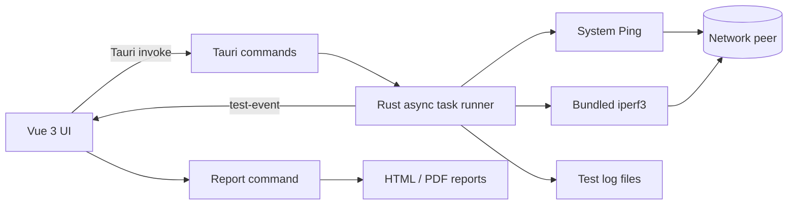

# iperf3 GUI

[English](README.md) | [简体中文](README.zh-CN.md)

A desktop network performance testing application built with Rust, Tauri 2, Vue 3, and TypeScript. It provides a structured GUI workflow for Ping, TCP, and UDP testing while keeping test execution, process control, and log persistence in the Rust backend.

> Current release status: Windows x64 is fully packaged as an NSIS installer with iperf3 3.21 included. Linux builds are supported from source and require preparing the bundled Linux runtime on a Linux build host.


## Features

- Client and server operating modes
- Separate TCP and UDP configuration views
- Ping connectivity checks
- TCP single-direction, bidirectional, parallel-stream, reverse, and stress tests
- UDP bandwidth, jitter, and packet-loss tests
- Sequential test queue with waiting, running, successful, failed, and stopped states
- Live bandwidth chart and aggregate statistics
- Local and peer network information
- Real-time INFO, WARN, and ERROR logs with filtering
- Per-test log files with completed/incomplete status in the filename
- Graceful test cancellation and unfinished queue recovery
- JSON configuration import, export, and local persistence
- HTML and PDF report generation
- Bundled iperf3 runtime with system `PATH` and custom-path fallback
- Windows and Linux build workflows

## Architecture



The application uses Tauri's two-process model:

- **Frontend:** Vue components render the configuration, dashboard, task queue, logs, chart, dialogs, and report summary. `src/App.vue` coordinates the test queue and persists recoverable state.
- **Backend:** Rust validates requests, resolves the iperf3 runtime, launches child processes asynchronously, parses output, emits typed events, saves logs, and creates reports.
- **IPC:** The frontend invokes a small command surface and receives `test-event` updates. Shell command construction and process ownership remain in Rust.
- **Runtime resolution:** A custom executable path takes priority. Otherwise, the backend selects the platform-specific bundled binary and falls back to `iperf3` from `PATH` only when the bundled resource is unavailable.

### Backend commands

| Command | Responsibility |
| --- | --- |
| `start_test` | Validate configuration and launch a Ping or iperf3 task |
| `stop_test` | Signal cancellation and terminate the active child process |
| `get_network_info` | Read the local IP address, MAC address, and hostname |
| `get_iperf_runtime_info` | Resolve and verify the bundled or external iperf3 runtime |
| `generate_report` | Generate an HTML or PDF report in the application data directory |

## Project Structure

```text
.
├── doc/                         # Reference UI and functional specification
├── scripts/                     # Platform-specific iperf3 preparation scripts
├── src/                         # Vue 3 frontend
│   ├── components/              # UI panels, chart, toolbar, and shared icons
│   ├── App.vue                  # Application state and task queue orchestration
│   ├── styles.css               # Desktop layout and visual system
│   └── types.ts                 # Frontend data contracts
├── src-tauri/
│   ├── resources/iperf3/        # Bundled runtime and third-party notices
│   ├── src/
│   │   ├── models.rs            # IPC and domain models
│   │   ├── runner.rs            # Async process execution, parsing, cancellation, logs
│   │   ├── runtime.rs           # Bundled runtime discovery and verification
│   │   ├── report.rs            # HTML/PDF report generation
│   │   └── system.rs            # Local network information
│   ├── Cargo.toml               # Rust dependencies
│   └── tauri.conf.json          # Desktop window, resources, and bundle configuration
├── package.json                 # Frontend dependencies and npm scripts
└── vite.config.ts               # Vite development/build configuration
```

## Dependencies

### Application stack

| Layer | Main dependencies | Purpose |
| --- | --- | --- |
| Desktop shell | Tauri 2 | Native window, IPC, paths, resources, and installers |
| Frontend | Vue 3, TypeScript, Vite | UI, application state, and production bundling |
| Charts | Chart.js, vue-chartjs | Live bandwidth visualization |
| Async runtime | Tokio | Child processes, file I/O, cancellation, and event loops |
| Serialization | Serde, serde_json | Typed frontend/backend payloads and configuration |
| Parsing | regex | iperf3 and Ping output parsing |
| System information | hostname, local-ip-address, mac_address | Local network identity |
| Utility | chrono, uuid | Timestamps, filenames, and session IDs |
| Test engine | iperf3 3.21 | TCP/UDP network performance measurement |

Exact JavaScript and Rust dependency constraints are recorded in `package-lock.json` and `src-tauri/Cargo.lock`.

## Prerequisites

### Windows development

- Windows 10 or Windows 11 x64
- Node.js 20 or later
- Rust stable with the MSVC toolchain
- Microsoft C++ Build Tools with **Desktop development with C++**
- Microsoft Edge WebView2 Runtime

See the official [Tauri prerequisites](https://v2.tauri.app/start/prerequisites/) for current platform requirements.

### Debian/Ubuntu development

Install the Tauri 2 system packages:

```bash
sudo apt update
sudo apt install -y \
  libwebkit2gtk-4.1-dev \
  build-essential \
  curl wget file \
  libxdo-dev libssl-dev \
  libayatana-appindicator3-dev \
  librsvg2-dev
```

Then install Node.js 20+ and Rust stable. Building the static Linux iperf3 runtime may additionally require the distribution's static libc development package.

## Getting Started

Clone the repository and install JavaScript dependencies:

```bash
git clone <repository-url>
cd iperf3-gui
npm ci
```

The Windows runtime is already stored under `src-tauri/resources/iperf3/windows-x86_64`. To download it again or update the vendored copy using the pinned checksum:

```powershell
npm run vendor:iperf3:windows
```

Start the Tauri development application:

```bash
npm run tauri dev
```

To run only the browser frontend, use `npm run dev`. The browser-only mode uses simulated test data because native commands are available only inside Tauri.

## Build

### Frontend and backend checks

```bash
npm run build
cargo check --manifest-path src-tauri/Cargo.toml
cargo test --manifest-path src-tauri/Cargo.toml
cargo fmt --manifest-path src-tauri/Cargo.toml -- --check
```

### Windows NSIS installer

```powershell
npm ci
npm run vendor:iperf3:windows
npm run tauri build
```

The installer is written to:

```text
src-tauri/target/release/bundle/nsis/iperf3 GUI 测试工具_<version>_x64-setup.exe
```

The installer contains `iperf3.exe`, `cygwin1.dll`, and the required third-party license files. End users do not need to install iperf3 separately.

### Linux AppImage and DEB

Prepare a static iperf3 runtime on the Linux build host:

```bash
sh scripts/vendor-iperf3-linux.sh 3.21
```

Build the packages:

```bash
npm ci
npm run tauri build -- --bundles appimage,deb
```

Build Linux artifacts on the oldest supported base distribution to avoid introducing a newer glibc requirement. See the [Tauri AppImage guidance](https://v2.tauri.app/distribute/appimage/).

## Installation

### Windows

1. Download the generated `*_x64-setup.exe` from the project release artifacts.
2. Verify its checksum when one is published with the release.
3. Run the installer and follow the NSIS wizard.
4. Start **iperf3 GUI 测试工具** from the Start menu.

The current installer is not code-signed, so Windows SmartScreen may display a warning for locally built or unpublished packages.

### Linux

- **AppImage:** mark the file executable and run it.

  ```bash
  chmod +x iperf3-gui_*.AppImage
  ./iperf3-gui_*.AppImage
  ```

- **Debian/Ubuntu:** install the DEB package.

  ```bash
  sudo apt install ./iperf3-gui_*.deb
  ```

## Usage

1. Choose **Client** or **Server** mode.
2. Select TCP or UDP and enable the required test items.
3. In client mode, enter the server address, port, duration, and protocol-specific parameters.
4. Start the test and monitor the task queue, live chart, statistics, and logs.
5. Stop a test when necessary. The partial log is retained, and the remaining queue can be recovered on the next launch.
6. Generate an HTML or PDF report after one or more tasks finish.

The peer must be reachable, its firewall must allow the configured TCP/UDP port, and an iperf3 server must be running when the application is used in client mode.

## Configuration and Data

- Configuration can be imported or exported as JSON.
- **Save Configuration** stores the current settings in the local WebView storage.
- `iperfPath` defaults to `bundled`. Set it to an absolute executable path to override the packaged runtime.
- Recovery state is stored locally and removed after the complete queue succeeds.
- Test logs are written under the OS-specific Tauri application log directory in `tests/`.
- Reports are written under the OS-specific Tauri application data directory in `reports/`.

Log filenames follow this pattern:

```text
<local-ip>-<server-ip>-<test-name>-<yyyyMMddHHmmss>-<完成|未完成>.log
```

## Bundled iperf3 and Supply Chain

- Version: iperf3 3.21
- Windows architecture: x86_64
- Windows binary source: [ar51an/iperf3-win-builds](https://github.com/ar51an/iperf3-win-builds)
- Upstream source: [ESnet/iperf](https://github.com/esnet/iperf)
- The Windows download script pins the release asset and verifies its SHA-256 before extraction.
- Runtime binaries and license notices are included as Tauri resources.

ESnet officially supports Linux, macOS, and FreeBSD; the bundled Windows binary is a community build. Review `src-tauri/resources/iperf3/THIRD-PARTY-NOTICES.md` before redistribution.

## Troubleshooting

| Symptom | Suggested action |
| --- | --- |
| Runtime shows unavailable | Re-run the vendor script or set `iperfPath` to a valid executable |
| Server does not respond | Check the address, port, firewall, routing, and server mode |
| No live samples appear | Confirm both peers use compatible iperf3 versions and the process produces interval output |
| Linux application does not start | Verify WebKitGTK 4.1 and distribution runtime dependencies |
| Windows build cannot replace the EXE | Close any running `iperf3-gui.exe` instance and rebuild |
| SmartScreen warning | Code-sign release installers with a trusted certificate |

## Contributing

Issues and pull requests are welcome after the repository is published.

1. Create a focused branch.
2. Keep UI contracts in `src/types.ts` aligned with Rust models.
3. Run the frontend build, Rust tests, and formatting checks.
4. Do not commit `node_modules`, `dist`, or `src-tauri/target`.
5. Do not replace third-party binaries without updating checksums and notices.

## License

This repository does not currently contain a project-wide root `LICENSE` file. Before publishing it as open source, the copyright holder must select and add a license, then update this section and the package metadata. Without an explicit project license, normal copyright restrictions apply to the application's original source code.

Third-party components retain their own licenses:

- iperf3: BSD-3-Clause
- Windows iperf3 build repository: Apache-2.0
- JavaScript and Rust dependencies: their respective upstream licenses

Complete redistribution notices for the bundled runtime are available in [`src-tauri/resources/iperf3/THIRD-PARTY-NOTICES.md`](src-tauri/resources/iperf3/THIRD-PARTY-NOTICES.md), with full license texts stored beside the binary.

## Acknowledgements

- [ESnet iperf3](https://github.com/esnet/iperf) for the network measurement engine
- [Tauri](https://tauri.app/) for the desktop application framework
- [Vue](https://vuejs.org/) and [Chart.js](https://www.chartjs.org/) for the frontend and visualization stack
