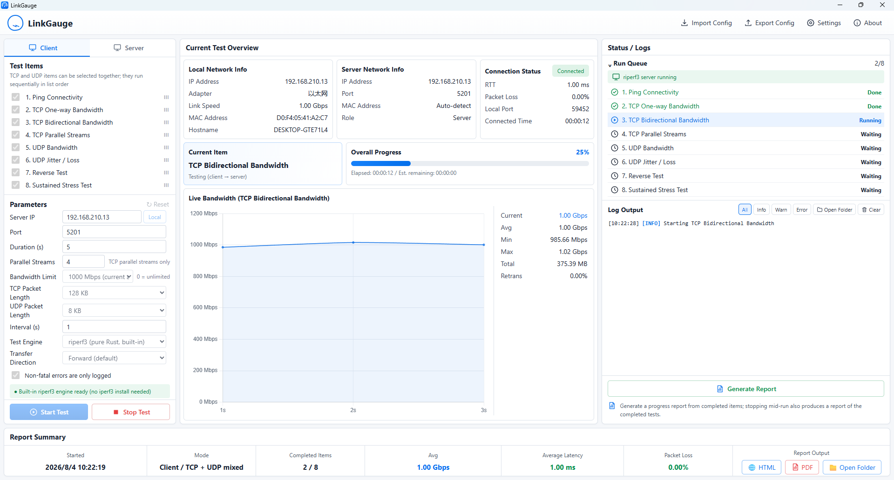
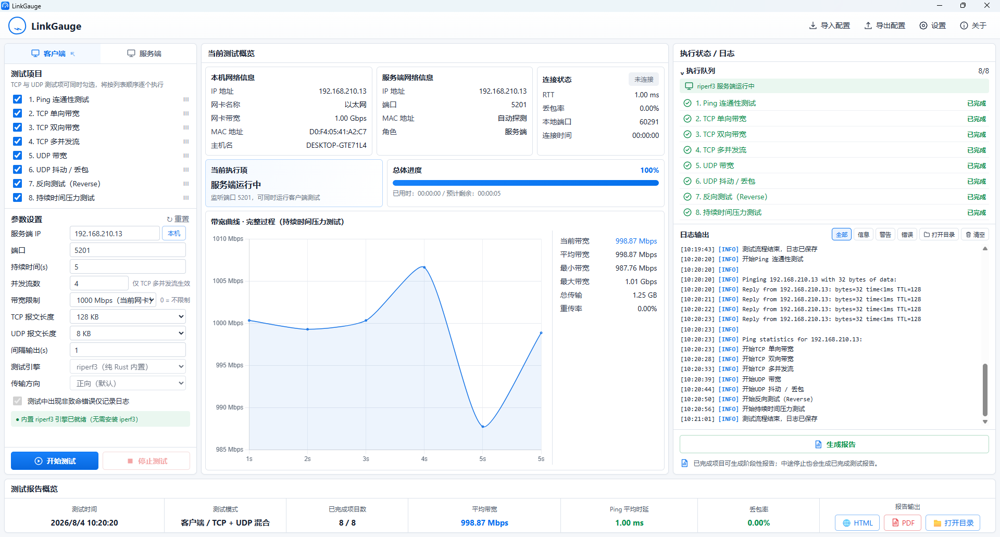
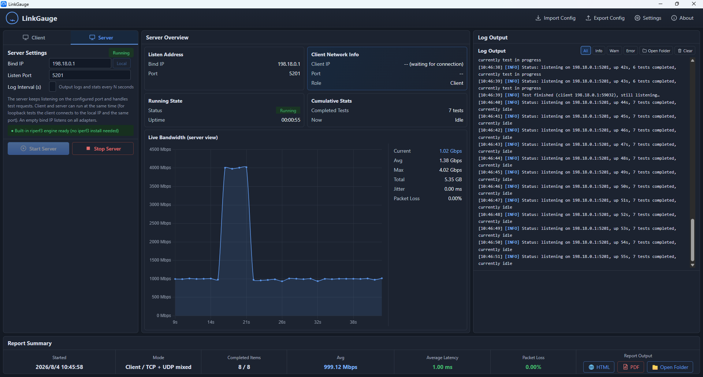
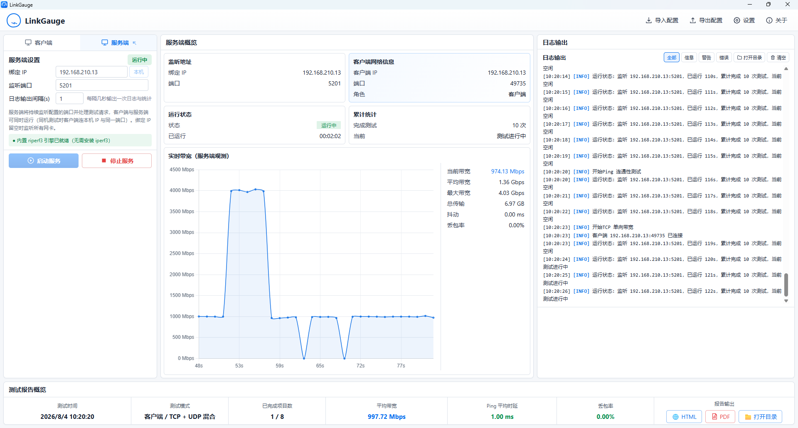
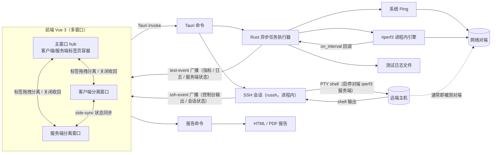

# LinkGauge

[](https://github.com/KISSMonX/LinkGauge/actions/workflows/ci.yml)
[](https://github.com/KISSMonX/LinkGauge/actions/workflows/release.yml)
[](https://github.com/KISSMonX/LinkGauge/releases)
[](#安装)

[English](README.md) | [简体中文](README.zh-CN.md)

一款基于 Rust、Tauri 2、Vue 3 和 TypeScript 开发的桌面网络性能测试工具。软件为 Ping、TCP 和 UDP 测试提供工程化图形流程，TCP/UDP 测试由纯 Rust、进程内运行的 [riperf3](https://github.com/therealevanhenry/riperf3) 引擎执行——该引擎直接实现 iperf3 线协议，无需安装、捆绑或启动任何 iperf3 可执行文件；仅 Ping 仍调用系统命令。内置 SSH 控制台（同样是纯 Rust、进程内实现）可直接启停远端主机上的对端 iperf3 服务端，无需切出应用。

> 当前发布状态：`v*` 标签（由 release-please 自动创建，见[持续集成](#持续集成)一节）会在 CI 中构建五份安装包——Windows x64（NSIS）、macOS x64 与 arm64（DMG）、Linux x64 与 arm64（AppImage + DEB）。目前均未做代码签名，首次运行的 SmartScreen / Gatekeeper 提示见[安装](#安装)一节。所有安装包都不包含任何第三方网络测试二进制。

## 界面截图

**客户端视图** — 左侧为测试项目勾选与参数配置，中间为实时带宽曲线及本机 / 对端 / 连接信息，右侧为任务队列与可筛选的实时日志，底部为报告概要。

| English | 简体中文 |
| --- | --- |
|  |  |

**服务端视图** — 左侧为监听配置与 SSH 连接设置，中间为服务端概览（监听地址、对端客户端、运行时长、累计完成测试）与服务端观测的带宽曲线（可切换到 SSH 远程控制台），右侧为服务端日志。

| English | 简体中文 |
| --- | --- |
|  |  |

## 功能特性

- 客户端和服务端两种运行模式
- 中英文界面（默认英文），可在「设置」中切换，跨窗口同步
- 亮色 / 暗色主题（默认亮色），可在「设置」中切换，跨窗口同步
- 服务端支持绑定指定 IP 与端口，并可设置日志 / 统计信息输出间隔（秒）
- 服务端防护选项：空闲超时（N 秒无客户端连接自动停止）、单次测试最大时长（拒绝超长请求）、聚合带宽上限（终止超速测试）
- 服务端页内置 SSH 远程控制台：以密码或私钥连接远端主机，在应用内的控制台里直接操作对端 iperf3 服务端并实时查看输出；基于纯 Rust 的 [russh](https://github.com/warp-tech/russh)，无需系统安装 `ssh` 客户端
- TCP、UDP 参数分离展示
- Ping 连通性测试
- TCP 单向、双向、多并发流、Reverse 和压力测试
- 按量（`-n` / `-k`）、MPTCP 多路径与 UDP 禁止分片（DF）测试项，与全局选项并存
- UDP 带宽、抖动和丢包率测试
- 串行测试队列及等待、运行、成功、失败、停止状态
- 实时带宽曲线和汇总统计
- 本机及对端网络信息展示
- 客户端概览显示当前连接的本地端口
- 多网卡检测与接口选择弹窗（默认选中第一个接口）并显示链路速率
- 带宽预设（100 / 1000 Mbps、不限），默认跟随当前网卡链路速率
- 客户端预热时间（`-O`）、TCP 套接字缓冲区（`-w`，0 = 自动）、源端口（`--cport`）与 IPv4/IPv6 显式选择选项
- 客户端 DSCP 标记（`--dscp`）与按量测试（`-n` / `-k`，传输量完成即结束）选项
- 客户端 TCP 拥塞控制算法（`-C`，Linux/FreeBSD）、UDP 禁止分片（`--dont-fragment`，IPv4）与 MPTCP 多路径（`-m`，需内核支持）选项
- 可选拉取对端服务端视角的输出（`--get-server-output`），随测试日志与报告展示
- 报文长度预设（TCP 最大 1 MB、UDP 最大 64 KB），自定义长度持久化到配置文件
- INFO、WARN、ERROR 实时日志与等级筛选
- 引擎日志跟随界面语言实时切换
- 按测试任务保存日志，文件名区分完成和未完成状态
- 测试安全中止（无未完成队列恢复，每次开始即全新测试）
- JSON 配置导入、导出和本地保存
- HTML、PDF 测试报告
- 纯 Rust riperf3 引擎：与标准 iperf3 服务端互通，无运行时外部依赖
- iperf3 双向认证支持——客户端提供用户名 / 密码 / RSA 公钥（兼容 3.17 前的 PKCS#1 填充）；服务端模式可用自己的 RSA 私钥 + 授权用户文件要求客户端凭据；密码不落盘
- 服务端忙时自动重试，避免队列中相邻测试项相互挤占
- CI 自动检查与打标签发布：Windows x64、macOS x64 / arm64、Linux x64 / arm64

## 软件架构



软件采用 Tauri 双进程模型：

- **前端：** Vue 组件负责参数配置、数据面板、任务队列、日志、曲线、弹窗和报告概览。`src/App.vue` 负责任务编排和参数持久化。
- **多窗口：** 客户端与服务端为可拖拽分离的标签页，分离成独立窗口后支持双屏 / 分屏观察。窗口间通过 `side-sync` 事件同步参数与运行状态，后端 `test-event` 广播到所有窗口；服务端窗口展示服务端自身独立的概览、实时曲线与日志，与客户端数据互不影响。
- **后端：** Rust 负责校验请求、驱动进程内 riperf3 引擎、通过 `on_interval` 回调逐秒推送指标、发送事件、保存日志和生成报告。
- **进程通信：** 前端仅调用有限的 Tauri 命令，并接收 `test-event`（以及 `ssh-event`）更新。测试执行与结果聚合完全保留在 Rust 侧。
- **远程操控：** 服务端视图可对对端主机建立 SSH 会话，在应用内的控制台里直接操作其 iperf3 服务端。会话、PTY shell 与输出解码都在 Rust 侧（[`russh`](https://github.com/warp-tech/russh)，同样是纯 Rust、进程内实现），前端只负责渲染文本流与发送按键。
- **引擎：** [riperf3](https://github.com/therealevanhenry/riperf3) 是从零实现的、与 iperf3 线协议兼容的 Rust 实现，vendor 在 `vendor/riperf3` 下并带有一个小补丁（实时 `on_interval` 回调），详见[测试引擎](#测试引擎-riperf3)。引擎在应用进程内运行，无需解析、启动或管理外部二进制，逐秒指标通过类型化回调到达，不再解析文本输出。

### 后端命令

| 命令 | 职责 |
| --- | --- |
| `start_test` | 校验配置并启动 Ping 或 riperf3 客户端/服务端任务 |
| `stop_test` | 发出取消信号：终止 Ping 进程或优雅中断 riperf3 测试 |
| `get_network_info` | 读取本机 IP、MAC 地址、主机名和链路速率 |
| `get_network_interfaces` | 枚举所有 up 状态的 IPv4 接口（含 MAC 地址和链路速率） |
| `get_custom_packet_length` | 从设置文件读取持久化的自定义报文长度 |
| `save_custom_packet_length` | 校验并持久化自定义报文长度到设置文件 |
| `generate_report` | 在应用数据目录中生成 HTML 或 PDF 报告 |
| `ssh_connect` | 连接远端主机并打开带 PTY 的交互式 shell |
| `ssh_send` | 向远端 shell 写入数据（命令文本、`Ctrl+C` 等） |
| `ssh_resize` | 按控制台可视区域同步远端 PTY 尺寸 |
| `ssh_disconnect` | 关闭 SSH 会话并释放通道 |
| `ssh_scrollback` | 读取会话快照（控制台回放缓冲 + 连接状态） |

### SSH 远程控制台

服务端视角在「服务端概览」旁新增「SSH 控制台」标签。用密码或 OpenSSH 私钥连接后，既可用快捷命令——启动 `iperf3 -s`（前台或 `-D` 后台）、查看进程、查看端口占用、停止全部、查看版本——也可直接输入任意命令。快捷命令按同一页面配置的监听端口与日志间隔拼接。远端输出经 `ssh-event` 实时回传，由轻量行缓冲渲染（ANSI 转义序列在 Rust 侧剔除，`\r` / `\b` 由前端处理），因此 `iperf3` 的逐秒统计能就地刷新。

主机密钥会与 `known_hosts` 比对：密钥变更时直接拒绝连接；首次连接的主机放行，并在控制台打印 SHA256 指纹供核对。登录密码与私钥口令只存在于内存，不写入 `localStorage`，也不随配置导出。

## 项目结构

```text
.
├── doc/                         # 参考界面和功能设计说明
├── src/                         # Vue 3 前端
│   ├── components/              # 面板、曲线、工具栏和通用图标
│   ├── App.vue                  # 应用状态和测试队列编排
│   ├── terminal.ts              # SSH 控制台行缓冲（回车 / 退格 / 制表位光标语义）
│   ├── styles.css               # 桌面布局与视觉样式
│   └── types.ts                 # 前端数据契约
├── src-tauri/
│   ├── src/
│   │   ├── models.rs            # IPC 与领域模型
│   │   ├── runner.rs            # riperf3 客户端/服务端任务、Ping、日志、中止
│   │   ├── report.rs            # HTML/PDF 报告生成
│   │   ├── settings.rs          # 设置文件的读取与持久化
│   │   ├── ssh.rs               # SSH 远程控制台：会话、PTY shell、输出解码
│   │   └── system.rs            # 本机网络信息
│   ├── Cargo.toml               # Rust 依赖
│   └── tauri.conf.json          # 窗口与安装包配置
├── vendor/riperf3/              # vendor 的 riperf3 库（MIT OR Apache-2.0）+ 本地补丁
├── package.json                 # 前端依赖和 npm 命令
└── vite.config.ts               # Vite 开发与构建配置
```

## 项目依赖

### 应用技术栈

| 层级 | 主要依赖 | 用途 |
| --- | --- | --- |
| 桌面框架 | Tauri 2 | 原生窗口、IPC、系统路径和安装包 |
| 前端 | Vue 3、TypeScript、Vite | 界面、应用状态和生产构建 |
| 曲线 | Chart.js、vue-chartjs | 实时带宽可视化 |
| 异步运行时 | Tokio | 异步任务、文件 I/O、中止和事件循环 |
| 序列化 | Serde、serde_json | 前后端类型化数据及配置 |
| 输出解析 | regex | 解析 Ping 输出 |
| 系统信息 | hostname、local-ip-address、mac_address | 本机网络标识 |
| 工具库 | chrono、uuid | 时间戳、文件名和会话 ID |
| 测试引擎 | riperf3（vendor，纯 Rust） | TCP/UDP 网络性能测量 |
| SSH 客户端 | russh（纯 Rust，ring 后端） | 远程控制台，用于操作对端 iperf3 服务端 |

JavaScript 和 Rust 依赖的确切约束分别记录在 `package-lock.json` 和 `src-tauri/Cargo.lock`。

## 开发环境要求

### Windows

- Windows 10 或 Windows 11 x64
- Node.js 20 或更高版本
- Rust stable 和 MSVC 工具链
- Microsoft C++ Build Tools，并安装 **Desktop development with C++**
- Microsoft Edge WebView2 Runtime

最新平台要求以 [Tauri 官方环境准备说明](https://v2.tauri.app/zh-cn/start/prerequisites/) 为准。

### Debian/Ubuntu

安装 Tauri 2 系统依赖：

```bash
sudo apt update
sudo apt install -y \
  libwebkit2gtk-4.1-dev \
  build-essential \
  curl wget file \
  libxdo-dev libssl-dev \
  libayatana-appindicator3-dev \
  librsvg2-dev
```

随后安装 Node.js 20+ 和 Rust stable。

### macOS

- macOS 11 或更高版本（Intel 或 Apple Silicon）
- Xcode Command Line Tools：`xcode-select --install`
- Node.js 20 或更高版本
- Rust stable；交叉构建另一架构时需补装对应 target，例如 `rustup target add x86_64-apple-darwin`

## 快速开始

克隆仓库并安装 JavaScript 依赖：

```bash
git clone git@github.com:KISSMonX/LinkGauge.git
cd LinkGauge
npm ci
```

启动 Tauri 开发应用：

```bash
npm run tauri dev
```

仅启动浏览器前端可运行 `npm run dev`。浏览器预览模式无法调用原生命令，因此会使用模拟测试数据。

## 构建

### 前端和后端检查

```bash
npm run build
cargo check --manifest-path src-tauri/Cargo.toml
cargo test --manifest-path src-tauri/Cargo.toml
cargo fmt --manifest-path src-tauri/Cargo.toml -- --check
cargo clippy --manifest-path src-tauri/Cargo.toml --all-targets -- -D warnings
```

### 持续集成

`.github/workflows/ci.yml` 在每次推送 `master` 和每个 Pull Request 上，于 `windows-latest`
与 `ubuntu-22.04` 两个平台执行前端构建（含 `vue-tsc`）、rustfmt、`-D warnings` 级别的
clippy 以及 Rust 测试。测试只使用回环 socket，runner 无需外网访问。

版本号与标签由 [release-please](https://github.com/googleapis/release-please) 自动管理：
`.github/workflows/release-please.yml` 在自上个标签以来的提交包含 `feat:`、`fix:` 或破坏性
变更时自动开 release PR——PR 会同步升级 `Cargo.toml`、`Cargo.lock`、`package.json`、
`package-lock.json` 与 `tauri.conf.json` 中的版本号，并重写 `CHANGELOG.md`。合并该 PR 即自动
创建 `v*` 标签和以 changelog 为正文的 **草稿** Release。版本语义遵循 Conventional Commits：
`fix:` → patch、`feat:` → minor、破坏性变更（`!`）→ major。请勿手动推送 `v*` 标签或手改
版本号文件——版本与标签均由 release-please 托管。

`.github/workflows/release.yml` 在该标签（或手动触发）时构建各平台安装包，全部产物汇总到
同一个 **草稿** Release：

| 任务 | Runner | Rust target | 产物 |
| --- | --- | --- | --- |
| Windows x64 | `windows-latest` | `x86_64-pc-windows-msvc` | NSIS `.exe` |
| macOS x64 | `macos-14`（交叉编译） | `x86_64-apple-darwin` | `.dmg`、`.app` |
| macOS arm64 | `macos-14` | `aarch64-apple-darwin` | `.dmg`、`.app` |
| Linux x64 | `ubuntu-22.04` | `x86_64-unknown-linux-gnu` | AppImage、DEB |
| Linux arm64 | `ubuntu-22.04-arm` | `aarch64-unknown-linux-gnu` | AppImage、DEB |

每个任务都显式传 `--bundles`，因为 `tauri.conf.json` 的 `bundle.targets` 固定为 `nsis`
（面向本地 Windows 构建）。`fail-fast` 已关闭，单个平台失败不影响其余平台出包。不需要配置
任何 secret——自动注入的 `GITHUB_TOKEN` 即可——但产物未做代码签名，[安装](#安装)一节的
SmartScreen / Gatekeeper 说明依然适用。构建完成后在 Releases 页面手动发布该草稿即可。

> Linux arm64 任务使用 GitHub 托管的 `ubuntu-22.04-arm` runner，**仅公开仓库免费**。私有
> 仓库需要包含 ARM runner 的付费方案，或自建 arm64 self-hosted runner；都没有的话请删掉该
> 矩阵条目。

### Windows NSIS 安装包

```powershell
npm ci
npm run tauri build
```

安装包输出到：

```text
src-tauri/target/release/bundle/nsis/LinkGauge_<version>_x64-setup.exe
```

安装包不包含任何外部运行时二进制，riperf3 引擎已编译进应用程序。

### Linux AppImage 和 DEB

构建安装包：

```bash
npm ci
npm run tauri build -- --bundles appimage,deb
```

Linux 产物应在计划支持的最旧基础发行版上构建，以避免引入过新的 glibc 要求。详见 [Tauri AppImage 指南](https://v2.tauri.app/distribute/appimage/)。

### macOS DMG

```bash
npm ci
npm run tauri build -- --target aarch64-apple-darwin --bundles dmg,app   # Apple Silicon
npm run tauri build -- --target x86_64-apple-darwin  --bundles dmg,app   # Intel
```

macOS 与 Linux 上必须显式传 `--bundles`，因为 `tauri.conf.json` 的 `bundle.targets` 固定为 `nsis`（面向本地 Windows 构建）。

## 安装

### Windows

1. 从项目发布产物中下载 `*_x64-setup.exe`。
2. 如果发布页提供校验值，请先验证文件哈希。
3. 运行安装程序并完成 NSIS 安装向导。
4. 从开始菜单启动 **LinkGauge**。

当前安装包尚未进行代码签名，本地构建或未正式发布的安装包可能触发 Windows SmartScreen 提示。

### Linux

- **AppImage：** 添加可执行权限后运行。

  ```bash
  chmod +x linkgauge_*.AppImage
  ./linkgauge_*.AppImage
  ```

- **Debian/Ubuntu：** 安装 DEB 包。

  ```bash
  sudo apt install ./linkgauge_*.deb
  ```

请按机器架构选择产物：x64 用 `*_amd64.*`，arm64 用 `*_arm64.*` / `*_aarch64.*`。

### macOS

1. 按架构下载 DMG——Intel 用 `*_x64.dmg`，Apple Silicon 用 `*_aarch64.dmg`。
2. 打开后把 **LinkGauge** 拖入 `Applications`。
3. 应用未做签名与公证，Gatekeeper 会拦截首次启动。可以右键点击应用选「打开」，或清除隔离属性：

   ```bash
   xattr -cr /Applications/LinkGauge.app
   ```

## 使用方法

1. 选择客户端或服务端模式。
2. 选择 TCP 或 UDP，并勾选需要执行的测试项目。
3. 客户端模式下填写服务端地址、端口、测试时间及协议参数。
4. 开始测试，在任务队列、实时曲线、统计信息和日志区域查看执行状态。
5. 必要时停止测试。中途失败的测试项目可在日志和报告中查看原因。
6. 一个或多个项目完成后，可生成 HTML 或 PDF 报告。

### 通过 SSH 操作对端服务端

当 iperf3 服务端跑在另一台机器上时，不必再单独开一个终端：

1. 切到「服务端」标签，填写「SSH 远程连接」表单——主机、端口、用户名，以及密码或 OpenSSH 私钥（私钥带口令则一并填写）。
2. 点击「连接」。中间栏会自动切到「SSH 控制台」标签；首次连接该主机时会打印主机密钥指纹供你核对。
3. 使用快捷命令——「启动 iperf3」（`iperf3 -s -p <端口> -i <间隔>`）、「后台启动」（`-D`）、「查看进程」、「查看端口」、「停止全部」、「版本」——也可直接输入任意命令。`^C` 用于中断远端前台运行的命令。
4. 随时可切回「服务端概览」，控制台会话继续运行，已有输出不会丢失。

快捷命令按同一页面配置的监听端口与日志间隔拼接，因此远端服务端与客户端标签页的端口天然一致。控制台不是完整的终端模拟器：它按 `\r` / `\b` / `\t` 的光标语义渲染文本（足以正确显示 `iperf3` 的逐秒统计与 shell 回显）并剔除 ANSI 转义序列，因此 `top` 这类全屏 curses 程序无法正常显示。

### 双窗口分屏

- 启动后客户端与服务端为两个标签页；**拖拽标签页**（拖出约 100px 后松开）即可将对应一侧分离为独立窗口，方便放到第二块屏幕或分屏各占一半。
- 分离窗口之间实时同步参数、测试状态、指标曲线与日志，任一窗口均可启动/停止测试。
- 服务端分离窗口展示服务端自身的概览（监听地址、对端客户端、运行时长、累计完成测试）、服务端观测的实时带宽曲线和仅含服务端日志的记录，与客户端数据相互独立；服务端窗口的「本机」按钮同样支持选择网卡。
- 关闭分离窗口（或点击其标题栏的「停靠回主窗口」）即可把标签收回主窗口；主窗口在所有标签分离后仍保留图表与日志作为观察视图。
- 关闭主窗口将退出整个应用，分离的子窗口会随之一同关闭。

客户端测试要求对端可达、防火墙允许配置的 TCP/UDP 端口，并且对端已有 iperf3 兼容服务端（标准 iperf3 3.x 或 riperf3）运行。

## 配置与数据

- 配置支持 JSON 导入和导出。
- “保存设置”将客户端与服务端参数自动写入本地 WebView 存储。
- 测试日志保存在 Tauri 对应操作系统的应用日志目录下的 `tests/`。
- 报告保存在 Tauri 对应操作系统的应用数据目录下的 `reports/`。
- 自定义报文长度持久化到 Tauri 应用配置目录下的 `settings.json`。
- SSH 连接参数（主机、端口、用户名、认证方式、私钥路径）与其他设置一同持久化；登录密码与私钥口令**不保存**——与 iperf3 认证密码一样只存在于内存，不写入导出的配置，重启后需重新输入。

日志文件名格式（服务端与客户端分开记录）：

```text
Server-<本机IP>-<端口>-<yyyyMMddHHmmss>-<完成|未完成>.log      # 服务端
Client-<本机IP>-<服务端IP>-<测试名称>-<yyyyMMddHHmmss>-<完成|未完成>.log   # 客户端
```

## 测试引擎（riperf3）

- 引擎：[riperf3](https://github.com/therealevanhenry/riperf3) —— 从零实现、与 iperf3 线协议兼容的 Rust 实现，vendor 于 `vendor/riperf3`（上游 HEAD，版本 0.9.0-dev）。
- 引擎**在应用进程内运行**：不安装、不捆绑、不解析、不启动任何 iperf3 可执行文件。逐秒指标通过类型化回调到达；测试可通过 watch 通道优雅中断。
- **本地补丁：** （1）上游只在测试结束后才暴露逐秒区间数据，因此新增了 `on_interval` 实时回调（见 `vendor/riperf3` 中 `IntervalReporterConfig`、`ClientBuilder::on_interval`、`ServerBuilder::on_interval`）；（2）最终 `sum_*` 汇总窗口排除 `-O` 预热段（iperf3 的 `[SUM]` 行打印 "omit-end sec"），避免预热测试的聚合带宽被低估；（3）服务端统计采样间隔可通过 `ServerBuilder::interval` 配置（上游固定 1s，无服务端 `-i` 旋钮）。补丁处均标注 `local LinkGauge patch` 注释；升级 vendor 源码后需重新应用。
- 互通性：与真实 iperf3 服务端/客户端互通（上游已针对 iperf 3.21 验证）。
- 已知平台差异：TCP 重传计数依赖 `TCP_INFO`，Windows 上不可用，该平台显示为 0。

## 与 iperf3 服务端的兼容性

客户端可直接对标准 iperf3 服务端（`iperf3 -s`）发起测试，无需对端安装 LinkGauge。riperf3 按 iperf3 线协议实现：37 字节 cookie、单字节状态机、4 字节大端长度前缀的 JSON 参数/结果交换，参数字段顺序亦与 iperf3 的 `send_parameters` 对齐，并兼容 iperf3 ≤ 3.12 的旧结果格式。

### 各测试项对服务端版本的要求

| 测试项 | 等价 iperf3 参数 | 服务端最低版本 |
| --- | --- | --- |
| Ping 连通性测试 | 走系统 `ping`，不经 iperf3 | 无要求 |
| TCP 单向带宽 / 多并发流 / 压力测试 | `-c` / `-P N` / `-t N` | 任意 3.x |
| TCP 按量 / 按块测试 | `-n` / `-k` | 任意 3.x |
| TCP MPTCP 多路径测试 | `-m` | 3.12+ |
| UDP 无分片（DF）测试 | `--dont-fragment` | 任意 3.x |
| TCP 反向测试 | `-R` | 3.1+ |
| **TCP 双向带宽** | `--bidir` | **3.7+** |
| UDP 带宽 / 抖动丢包 | `-u` | 任意 3.x |

对 3.7 以下的服务端，`bidirectional` 参数会被静默忽略：服务端按单向执行而客户端按双向解读，不报错但数据不可信。请改用「TCP 单向带宽」与「TCP 反向测试」组合。

### 默认参数对齐

- **UDP 报文长度默认 1460 字节**，与 iperf3 的 `DEFAULT_UDP_BLKSIZE` 一致。更大的值（如旧版默认的 8 KB）在 1500 MTU 路径上会触发 IP 分片，丢包率被分片放大，结果无法与原生 `iperf3 -u -c` 对比。预设中 1460 与 1472 均不分片。
  > 从旧版本升级时，已保存的 8192 会自动迁移为 1460；如确需大报文，可在下拉框中重新选择。
- **TCP 报文长度默认 128 KB**，与 iperf3 一致。
- **带宽选「不限制」即真正不限速**（等价 `-b 0`）。注意 iperf3 命令行的 `-u` 在不带 `-b` 时默认限速 1 Mbit/s，本软件不沿用该默认。
- **默认不预热**（`-O` 关闭）。预热时间必须小于测试时长。
- **TCP 套接字缓冲区默认 0（自动）**，与 iperf3 的 `-w` 默认一致；填写 KB 数值可覆盖。
- **客户端源端口默认 0（自动）**（iperf3 `--cport` 关闭）；设置后第 i 条数据流绑定源端口 `cport + i`，与 iperf3 一致。
- **IP 协议族默认自动**；服务端地址为主机名且主机双栈时，可强制仅 IPv4 或仅 IPv6。
- **默认不设置 DSCP 标记**（0 = 不设置，等价 iperf3 不带 `--dscp`）；取值 1–63 映射到 TOS 高 6 位。
- **默认不启用按量测试**；启用后（`-n` / `-k`）传输量完成即结束并忽略时长，且与预热互斥（iperf3 命令行同样拒绝）。
- **拥塞控制算法默认不设置**；`-C` 仅在 Linux/FreeBSD 生效，其他平台给出明确提示后拒绝。
- **UDP 禁止分片默认关闭**；启用后对 IPv4 UDP 数据报设置 DF 标志。
- **MPTCP 默认关闭**；需要两端内核支持，不支持的平台上连接阶段会报错。

### 认证

**客户端侧：** 对端 iperf3 若以 `--rsa-private-key-path` + `--authorized-users-path` 启动，需在客户端「认证」区勾选启用，并填写用户名、密码与服务端 RSA 公钥文件路径。

- iperf3 3.17 起默认 OAEP 填充；对更早的服务端请勾选「使用 PKCS#1 填充」。
- **密码不会写入本地存储，也不会包含在导出的配置 JSON 中**，重启应用后需重新输入。用户名与公钥路径不属机密，照常保存。

**服务端侧：** 服务端视图有独立的「服务端认证」区。启用后选择 RSA 私钥（`--rsa-private-key-path`）与授权用户文件（`--authorized-users-path`），此后每个客户端必须先通过认证才能测试，未授权客户端会被拒绝。授权用户文件每行一个用户：`用户名,sha256hex`（哈希为 `sha256("{用户名}{密码}")`，`#` 开头为注释）。客户端用同一组用户名/密码连接，并持有服务端对应的公钥（见上文「客户端侧」）。私钥与用户文件路径不属机密，随服务端其他设置一并保存。

### 服务端忙自动重试

iperf3 服务端一次只服务一个测试。队列中相邻测试项之间，对端可能尚未回到监听状态，此时会返回「服务端忙」。客户端会自动重试 3 次、间隔 2 秒，重试期间点击「停止测试」立即生效；仍失败才判定该项失败。

### 其他已知差异

- Windows 上 TCP 重传计数恒为 0（依赖 `TCP_INFO`，该平台不可用）。
- 授权用户文件采用 riperf3 的「用户名,sha256hex」行格式，与 iperf3 官方工具链的 JSON 格式不同。
- 设置空闲超时后，到期时 LinkGauge 服务端自动停止（引擎的 one_off 模式空闲即退出，而非重启监听）。

## 常见问题

| 现象 | 建议处理方式 |
| --- | --- |
| 服务端无响应 | 检查地址、端口、防火墙、路由和服务端模式 |
| 没有实时采样 | 确认对端运行 iperf3 兼容服务端（iperf3 3.x 或 riperf3），且输出周期 ≥ 1 秒 |
| Linux 应用无法启动 | 检查 WebKitGTK 4.1 和发行版运行依赖 |
| Windows 构建无法替换 EXE | 关闭正在运行的 `linkgauge.exe` 后重新构建 |
| SmartScreen 告警 | 使用可信代码签名证书签署正式安装包 |
| 对端重装系统后 SSH 拒绝连接 | 主机密钥与 `known_hosts` 记录不符；确认变更符合预期后，删除该主机的旧记录 |
| SSH 私钥被拒绝 | 私钥带口令时需填写口令。OpenSSH、PKCS#1 / PKCS#8 PEM 与 PuTTY `.ppk` 格式均可识别 |
| 远端提示找不到 `iperf3` | 快捷命令依赖登录 shell 的 `PATH`；请在对端安装 iperf3，或在控制台里输入完整路径 |

## TODO

### 待办事项

- [x] SSH 支持（通过 SSH 操作远程主机上的对端 iperf3 服务端）
- [ ] 对正式安装包进行代码签名，消除 Windows SmartScreen 告警
- [ ] 在受支持的最旧基础发行版上验证 Linux AppImage / DEB 的构建与运行
- [ ] 补充项目级 LICENSE 文件及包元数据
- [x] 建立 CI/CD（GitHub Actions）自动检查与发布构建
- [ ] 测试结果历史记录与多轮对比功能
- [ ] 前端关键逻辑单元测试

## 参与贡献

仓库公开后欢迎提交 Issue 和 Pull Request。

1. 创建职责单一的开发分支。
2. 修改数据结构时，保持 `src/types.ts` 与 Rust 模型一致。
3. 提交前运行前端构建、Rust 测试和格式检查。
4. 不要提交 `node_modules`、`dist` 或 `src-tauri/target`。
5. 升级 `vendor/riperf3` 时，保持本地补丁（`on_interval`）同步，并更新本文档中的引擎版本说明。

## 许可证

当前仓库根目录尚无项目级 `LICENSE` 文件。正式作为开源项目发布前，版权持有人需要选择并添加许可证，同时更新本节和包元数据。在没有明确项目许可证的情况下，应用原创源代码仍受默认版权限制。

第三方组件继续遵循其各自许可证：

- riperf3：MIT OR Apache-2.0（见 [`THIRD-PARTY-NOTICES.md`](THIRD-PARTY-NOTICES.md) 及 `vendor/riperf3/` 下的许可证全文）
- JavaScript 和 Rust 依赖：各上游项目声明的许可证

## 致谢

- [riperf3](https://github.com/therealevanhenry/riperf3)：纯 Rust 的 iperf3 兼容测试引擎
- [ESnet iperf3](https://github.com/esnet/iperf)：本工具所互通线协议的定义者
- [Tauri](https://tauri.app/)：桌面应用框架
- [Vue](https://vuejs.org/) 与 [Chart.js](https://www.chartjs.org/)：前端和数据可视化技术栈
- [DeepSeek](https://deepseek.com/)：参与本版本的 AI 辅助开发——iperf3 选项集、服务端改进与问题修复
