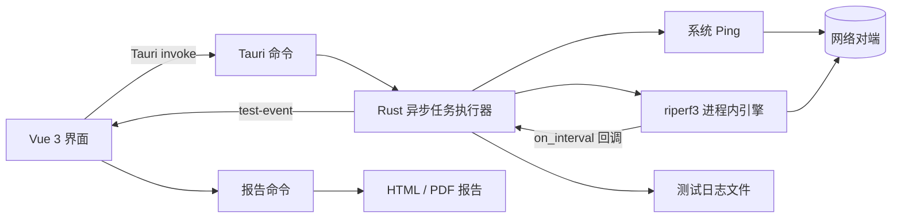

# LinkGauge

[English](README.md) | [简体中文](README.zh-CN.md)

一款基于 Rust、Tauri 2、Vue 3 和 TypeScript 开发的桌面网络性能测试工具。软件为 Ping、TCP 和 UDP 测试提供工程化图形流程，TCP/UDP 测试由纯 Rust、进程内运行的 [riperf3](https://github.com/therealevanhenry/riperf3) 引擎执行——该引擎直接实现 iperf3 线协议，无需安装、捆绑或启动任何 iperf3 可执行文件；仅 Ping 仍调用系统命令。

> 当前发布状态：Windows x64 已支持生成 NSIS 安装包。Linux 支持从源码构建。安装包内不包含任何第三方网络测试二进制。


## 功能特性

- 客户端和服务端两种运行模式
- TCP、UDP 参数分离展示
- Ping 连通性测试
- TCP 单向、双向、多并发流、Reverse 和压力测试
- UDP 带宽、抖动和丢包率测试
- 串行测试队列及等待、运行、成功、失败、停止状态
- 实时带宽曲线和汇总统计
- 本机及对端网络信息展示
- 多网卡检测与接口选择弹窗（默认选中第一个接口）并显示链路速率
- 带宽预设（100 / 1000 Mbps、不限），默认跟随当前网卡链路速率
- 报文长度预设（128 字节至 64 KB），自定义长度持久化到配置文件
- INFO、WARN、ERROR 实时日志与等级筛选
- 按测试任务保存日志，文件名区分完成和未完成状态
- 测试安全中止及未完成队列恢复
- JSON 配置导入、导出和本地保存
- HTML、PDF 测试报告
- 纯 Rust riperf3 引擎：与标准 iperf3 服务端互通，无运行时外部依赖
- Windows、Linux 构建流程

## 软件架构



软件采用 Tauri 双进程模型：

- **前端：** Vue 组件负责参数配置、数据面板、任务队列、日志、曲线、弹窗和报告概览。`src/App.vue` 负责任务编排和可恢复状态持久化。
- **后端：** Rust 负责校验请求、驱动进程内 riperf3 引擎、通过 `on_interval` 回调逐秒推送指标、发送事件、保存日志和生成报告。
- **进程通信：** 前端仅调用有限的 Tauri 命令，并接收 `test-event` 更新。测试执行与结果聚合完全保留在 Rust 侧。
- **引擎：** [riperf3](https://github.com/therealevanhenry/riperf3) 是从零实现的、与 iperf3 线协议兼容的 Rust 实现，vendor 在 `vendor/riperf3` 下并带有一个小补丁（实时 `on_interval` 回调），详见[测试引擎](#测试引擎-riperf3)。引擎在应用进程内运行，无需解析、启动或管理外部二进制，逐秒指标通过类型化回调到达，不再解析文本输出。

### 后端命令

| 命令 | 职责 |
| --- | --- |
| `start_test` | 校验配置并启动 Ping 或 riperf3 客户端/服务端任务 |
| `stop_test` | 发出取消信号：终止 Ping 进程或优雅中断 riperf3 测试 |
| `get_network_info` | 读取本机 IP、MAC 地址、主机名和链路速率 |
| `get_network_interfaces` | 枚举所有 up 状态的 IPv4 接口（含 MAC 地址和链路速率） |
| `get_custom_packet_length` | 从设置文件读取持久化的自定义报文长度 |
| `save_custom_packet_length` | 校验并持久化自定义报文长度到设置文件 |
| `generate_report` | 在应用数据目录中生成 HTML 或 PDF 报告 |

## 项目结构

```text
.
├── doc/                         # 参考界面和功能设计说明
├── src/                         # Vue 3 前端
│   ├── components/              # 面板、曲线、工具栏和通用图标
│   ├── App.vue                  # 应用状态和测试队列编排
│   ├── styles.css               # 桌面布局与视觉样式
│   └── types.ts                 # 前端数据契约
├── src-tauri/
│   ├── src/
│   │   ├── models.rs            # IPC 与领域模型
│   │   ├── runner.rs            # riperf3 客户端/服务端任务、Ping、日志、中止
│   │   ├── report.rs            # HTML/PDF 报告生成
│   │   ├── settings.rs          # 设置文件的读取与持久化
│   │   └── system.rs            # 本机网络信息
│   ├── Cargo.toml               # Rust 依赖
│   └── tauri.conf.json          # 窗口与安装包配置
├── vendor/riperf3/              # vendor 的 riperf3 库（MIT OR Apache-2.0）+ 本地补丁
├── package.json                 # 前端依赖和 npm 命令
└── vite.config.ts               # Vite 开发与构建配置
```

## 项目依赖

### 应用技术栈

| 层级 | 主要依赖 | 用途 |
| --- | --- | --- |
| 桌面框架 | Tauri 2 | 原生窗口、IPC、系统路径和安装包 |
| 前端 | Vue 3、TypeScript、Vite | 界面、应用状态和生产构建 |
| 曲线 | Chart.js、vue-chartjs | 实时带宽可视化 |
| 异步运行时 | Tokio | 异步任务、文件 I/O、中止和事件循环 |
| 序列化 | Serde、serde_json | 前后端类型化数据及配置 |
| 输出解析 | regex | 解析 Ping 输出 |
| 系统信息 | hostname、local-ip-address、mac_address | 本机网络标识 |
| 工具库 | chrono、uuid | 时间戳、文件名和会话 ID |
| 测试引擎 | riperf3（vendor，纯 Rust） | TCP/UDP 网络性能测量 |

JavaScript 和 Rust 依赖的确切约束分别记录在 `package-lock.json` 和 `src-tauri/Cargo.lock`。

## 开发环境要求

### Windows

- Windows 10 或 Windows 11 x64
- Node.js 20 或更高版本
- Rust stable 和 MSVC 工具链
- Microsoft C++ Build Tools，并安装 **Desktop development with C++**
- Microsoft Edge WebView2 Runtime

最新平台要求以 [Tauri 官方环境准备说明](https://v2.tauri.app/zh-cn/start/prerequisites/) 为准。

### Debian/Ubuntu

安装 Tauri 2 系统依赖：

```bash
sudo apt update
sudo apt install -y \
  libwebkit2gtk-4.1-dev \
  build-essential \
  curl wget file \
  libxdo-dev libssl-dev \
  libayatana-appindicator3-dev \
  librsvg2-dev
```

随后安装 Node.js 20+ 和 Rust stable。

## 快速开始

克隆仓库并安装 JavaScript 依赖：

```bash
git clone git@github.com:KISSMonX/LinkGauge.git
cd LinkGauge
npm ci
```

启动 Tauri 开发应用：

```bash
npm run tauri dev
```

仅启动浏览器前端可运行 `npm run dev`。浏览器预览模式无法调用原生命令，因此会使用模拟测试数据。

## 构建

### 前端和后端检查

```bash
npm run build
cargo check --manifest-path src-tauri/Cargo.toml
cargo test --manifest-path src-tauri/Cargo.toml
cargo fmt --manifest-path src-tauri/Cargo.toml -- --check
```

### Windows NSIS 安装包

```powershell
npm ci
npm run tauri build
```

安装包输出到：

```text
src-tauri/target/release/bundle/nsis/LinkGauge_<version>_x64-setup.exe
```

安装包不包含任何外部运行时二进制，riperf3 引擎已编译进应用程序。

### Linux AppImage 和 DEB

构建安装包：

```bash
npm ci
npm run tauri build -- --bundles appimage,deb
```

Linux 产物应在计划支持的最旧基础发行版上构建，以避免引入过新的 glibc 要求。详见 [Tauri AppImage 指南](https://v2.tauri.app/distribute/appimage/)。

## 安装

### Windows

1. 从项目发布产物中下载 `*_x64-setup.exe`。
2. 如果发布页提供校验值，请先验证文件哈希。
3. 运行安装程序并完成 NSIS 安装向导。
4. 从开始菜单启动 **LinkGauge**。

当前安装包尚未进行代码签名，本地构建或未正式发布的安装包可能触发 Windows SmartScreen 提示。

### Linux

- **AppImage：** 添加可执行权限后运行。

  ```bash
  chmod +x linkgauge_*.AppImage
  ./linkgauge_*.AppImage
  ```

- **Debian/Ubuntu：** 安装 DEB 包。

  ```bash
  sudo apt install ./linkgauge_*.deb
  ```

## 使用方法

1. 选择客户端或服务端模式。
2. 选择 TCP 或 UDP，并勾选需要执行的测试项目。
3. 客户端模式下填写服务端地址、端口、测试时间及协议参数。
4. 开始测试，在任务队列、实时曲线、统计信息和日志区域查看执行状态。
5. 必要时停止测试。软件会保留部分日志，并在下次启动时恢复剩余队列。
6. 一个或多个项目完成后，可生成 HTML 或 PDF 报告。

客户端测试要求对端可达、防火墙允许配置的 TCP/UDP 端口，并且对端已有 iperf3 兼容服务端（标准 iperf3 3.x 或 riperf3）运行。

## 配置与数据

- 配置支持 JSON 导入和导出。
- “保存配置”将当前设置写入本地 WebView 存储。
- 中断恢复状态保存在本地；全部队列成功后自动清除。
- 测试日志保存在 Tauri 对应操作系统的应用日志目录下的 `tests/`。
- 报告保存在 Tauri 对应操作系统的应用数据目录下的 `reports/`。
- 自定义报文长度持久化到 Tauri 应用配置目录下的 `settings.json`。

日志文件名格式：

```text
<本机IP>-<服务端IP>-<测试名称>-<yyyyMMddHHmmss>-<完成|未完成>.log
```

## 测试引擎（riperf3）

- 引擎：[riperf3](https://github.com/therealevanhenry/riperf3) —— 从零实现、与 iperf3 线协议兼容的 Rust 实现，vendor 于 `vendor/riperf3`（上游 HEAD，版本 0.9.0-dev）。
- 引擎**在应用进程内运行**：不安装、不捆绑、不解析、不启动任何 iperf3 可执行文件。逐秒指标通过类型化回调到达；测试可通过 watch 通道优雅中断。
- **本地补丁：** 上游只在测试结束后才暴露逐秒区间数据，因此新增了 `on_interval` 实时回调（见 `vendor/riperf3` 中 `IntervalReporterConfig`、`ClientBuilder::on_interval`、`ServerBuilder::on_interval`）。补丁处均标注 `local LinkGauge patch` 注释；升级 vendor 源码后需重新应用。
- 互通性：与真实 iperf3 服务端/客户端互通（上游已针对 iperf 3.21 验证）。
- 已知平台差异：TCP 重传计数依赖 `TCP_INFO`，Windows 上不可用，该平台显示为 0。

## 常见问题

| 现象 | 建议处理方式 |
| --- | --- |
| 服务端无响应 | 检查地址、端口、防火墙、路由和服务端模式 |
| 没有实时采样 | 确认对端运行 iperf3 兼容服务端（iperf3 3.x 或 riperf3），且输出周期 ≥ 1 秒 |
| Linux 应用无法启动 | 检查 WebKitGTK 4.1 和发行版运行依赖 |
| Windows 构建无法替换 EXE | 关闭正在运行的 `linkgauge.exe` 后重新构建 |
| SmartScreen 告警 | 使用可信代码签名证书签署正式安装包 |

## TODO

### 待办事项

- [ ] 对正式安装包进行代码签名，消除 Windows SmartScreen 告警
- [ ] 在受支持的最旧基础发行版上验证 Linux AppImage / DEB 的构建与运行
- [ ] 补充项目级 LICENSE 文件及包元数据
- [ ] 建立 CI/CD（如 GitHub Actions）自动构建与发布
- [ ] 测试结果历史记录与多轮对比功能
- [ ] 前端关键逻辑单元测试

## 参与贡献

仓库公开后欢迎提交 Issue 和 Pull Request。

1. 创建职责单一的开发分支。
2. 修改数据结构时，保持 `src/types.ts` 与 Rust 模型一致。
3. 提交前运行前端构建、Rust 测试和格式检查。
4. 不要提交 `node_modules`、`dist` 或 `src-tauri/target`。
5. 升级 `vendor/riperf3` 时，保持本地补丁（`on_interval`）同步，并更新本文档中的引擎版本说明。

## 许可证

当前仓库根目录尚无项目级 `LICENSE` 文件。正式作为开源项目发布前，版权持有人需要选择并添加许可证，同时更新本节和包元数据。在没有明确项目许可证的情况下，应用原创源代码仍受默认版权限制。

第三方组件继续遵循其各自许可证：

- riperf3：MIT OR Apache-2.0（见 [`THIRD-PARTY-NOTICES.md`](THIRD-PARTY-NOTICES.md) 及 `vendor/riperf3/` 下的许可证全文）
- JavaScript 和 Rust 依赖：各上游项目声明的许可证

## 致谢

- [riperf3](https://github.com/therealevanhenry/riperf3)：纯 Rust 的 iperf3 兼容测试引擎
- [ESnet iperf3](https://github.com/esnet/iperf)：本工具所互通线协议的定义者
- [Tauri](https://tauri.app/)：桌面应用框架
- [Vue](https://vuejs.org/) 与 [Chart.js](https://www.chartjs.org/)：前端和数据可视化技术栈
